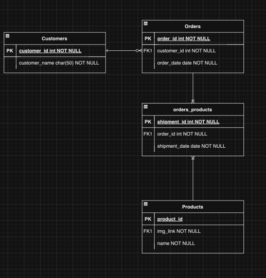

# Modul 150 Microservices

## Übersicht

In diesem Modul wurde ein vintage Online-Store mithilfe von Microservices. Insgesamt wurden 5 Services.
für dieses Projekt gebraucht.

## Setup
Individuell die docker-compose.yml starten, damit die Container für jeden Microservice verfügbar ist. Anschliessend kann
man im Root Ordner die Services via Intellij mit dem "Services" Tab im IntelliJ starten.

### Eureka Server

Als Erstes wird der Eureka Microservice gestartet, damit er alle Services finden kann und die auch dementsprechend verwalten.
verwalten.

### MongoDB

Im MongoDB-Service wird der Job des Warenkorbs übernommen. Hier werden die Waren im Warenkorb gespeichert.

### SQL - Product_Catalog
Hier werden die Bestellungen, Nutzer und Waren verwaltet. Mit der persistenten Schicht wird sichergestellt, dass die Bestellungen auffindbar sind und abrufbar via Product_Catalog Service.

ERM:

### Kafka
Mit Kafka Service wird die logistische Ebene in der Applikation repräsentiert. Sobald eine Bestellung reinkommt,
wird via Kafka and die Logistic eine Nachricht eine neue Bestellung weitergeleitet. Das gleiche passiert wenn eine 
Bestellung fertig verarbeitet wurde. 

