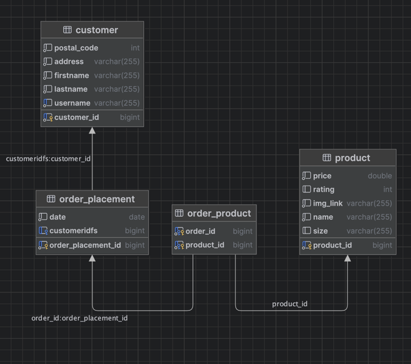

# Modul 150 Microservices

## Übersicht

In diesem Modul wurde ein vintage Online-Store mithilfe von Microservices. Insgesamt wurden 5 Services.
für dieses Projekt gebraucht.

## Setup
Individuell die docker-compose.yml starten, damit die Container für jeden Microservice verfügbar ist. Anschliessend kann
man im Root Ordner die Services via Intellij mit dem "Services" Tab im IntelliJ starten.

### Eureka Server

Als Erstes wird der Eureka Microservice gestartet, damit er alle Services finden kann und die auch dementsprechend verwalten.
verwalten.

### MongoDB

Im MongoDB-Service wird der Job des Warenkorbs übernommen. Hier werden die Waren im Warenkorb gespeichert. Welche Werte 
gespeichert werden sieht man genauer im ERM Diagramm. Zudem hält es auch einen Überblick in der Logistic, welche Bestellungen
fertig sind und welche bearbeitet werden müssen.

### SQL - Product_Catalog
Hier werden die Bestellungen, Nutzer und Waren verwaltet. Mit der persistenten Schicht wird sichergestellt, dass die Bestellungen auffindbar und abrufbar sind via Product_Catalog Service.
Zudem gibt es noch ein ERM welches die persistente Schicht in der Applikation darstellt:

ERM:


Wichtig zu beachten, ist die Zwischentabelle order_product. Dies nimmt die Produkte mit den Bestellungen auf. Damit kann 
auch die jeweilige Bestellung Waren den einzelnen Kunden zugeordnet werden. 

### Kafka - logistic processor
Mit Kafka Service wird die logistische Ebene in der Applikation repräsentiert. Sobald eine Bestellung reinkommt,
wird via Kafka and die Logistic eine Nachricht eine neue Bestellung weitergeleitet. Das Gleiche passiert, wenn eine 
Bestellung fertig verarbeitet wurde. Dann wird die Nachricht an die Konsole weitergegeben, was in diesem Project die
logistic Abteilung repräsentiert. Daher muss in der Kontrolle spezifisch draufgeschaut werden. 

### Gateway
Mit dem Gateway Service wurde die ganze Kommunikation auf Port 8084 verlegt. Hier werden alle Endpunkte zu den verschiedenen
Microservices konfiguriert und individuelle Namen dafür bereitgestellt in der Konfiguration. Zudem kann man die Security für 
alle Endpunkte hier in der App verwalten und bestimmen. 

### Paypal

Paypal service wurde nicht vollständig implementiert, da die Umgebung für dev nicht vollständig implementiert ist. Aber 
das Proof of concept ist da. 

### API dokumentation

Um die API genauer anzuschauen, wurde Postman hinterlegt(modul_150_collection.json). Hierfür einfach im Postman selbst importieren.

Zudem haben die Services logistic, product_catalog und warenkorb ihren eigenen Swagger UI. Der wäre verfügbar auf:
```http://localhost:{port des services}/swagger-ui/index.html```


